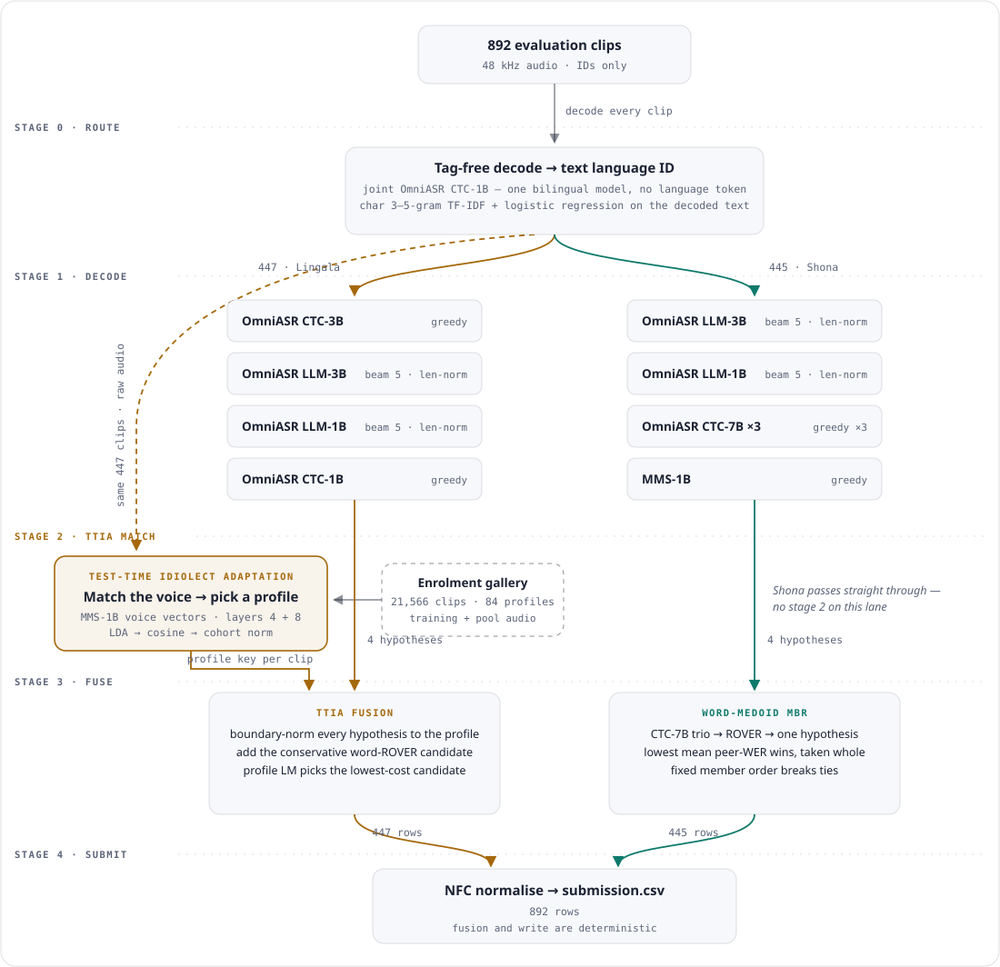

# Waxal ASR — Lingala and Shona

Solution for the [Google Waxal ASR Challenge](https://zindi.africa/competitions/google-waxal-asr-challenge)
on Zindi: two four-model ensembles — one per language — plus a routing model
and a Lingala voice embedder, all fine-tuned speech models, transcribing
Lingala and Shona audio. Shona fuses by word-medoid MBR. Lingala fuses by
Test-Time Idiolect Adaptation (TTIA): each test clip's voice is matched against
an enrolment gallery of idiolect profiles, and the fusion scores its candidates
against the matched profile's training text.

Ranked **9th** on the private leaderboard (Q 0.7675). Every per-clip decision
is derived from the audio: a tag-free bilingual model transcribes each clip and
a character n-gram classifier routes it on the decoded text; voice vectors from
the same audio drive the TTIA match.

## Table of contents

- [Overview](#overview)
- [Data](#data)
- [Architecture](#architecture)
- [Models](#models)
- [Test-Time Idiolect Adaptation](#test-time-idiolect-adaptation)
- [Results](#results)
- [Reproduce — step-by-step walkthrough](#reproduce--step-by-step-walkthrough)
- [Environment & runtime](#environment--runtime)
- [What's on GitHub vs Hugging Face](#whats-on-github-vs-hugging-face)
- [Licences & intended use](#licences--intended-use)
- [Repo layout](#repo-layout)

## Overview

Transcribe 892 audio clips in Lingala and Shona, scored by

```
Q = 1 − ½ (CER + WER)
```

with CER pooled across the corpus and WER averaged per utterance; higher is
better. Character and word error weigh equally, so fixing whole words matters
more than fixing stray characters — and the two languages are disjoint row
sets, so **the two lanes' contributions add exactly** and each can be
measured and improved on its own.

The pipeline runs in five stages: route each clip by language from its own
decoded text, decode each lane with four models, match each Lingala clip's
voice to an idiolect profile, fuse per lane, and write the submission.

## Data

| Asset | Size | Role |
|---|---|---|
| Evaluation audio (`data/test_audio/`) | 892 WAV clips, 48 kHz | what the pipeline transcribes |
| `google/WaxalNLP` gold transcripts | 32,328 rows | fine-tuning, the text language classifier, TTIA training text |
| `google/WaxalNLP` unlabelled release | 5,531 clips used | pool audio for the TTIA gallery |
| Enrolment gallery ([`waxal-ttia-gallery`](https://huggingface.co/datasets/DariusTheGeek/waxal-ttia-gallery)) | 21,566 clips · 84 profiles | TTIA voice matching |

Place the evaluation clips under `data/test_audio/`, one WAV per clip named
by its ID (`data/test_audio/ID_AAOODF.wav`, …) — the pipeline matches clips to
IDs by filename stem. Nothing under `data/` is committed except
`data/provenance/SOURCES.json`; the enrolment gallery and TTIA training text
are fetched by [`models/download_assets.py`](models/download_assets.py), and
training manifests and audio are built from
`google/WaxalNLP` into `data/derived/` (copy or hardlink data in — the
training code rejects paths that escape the repository, `cp -al` links a
corpus in at no storage cost on one filesystem).

Audio is resampled to 16 kHz mono — no trimming, no VAD, no augmentation.
Transcripts are NFC-normalised with whitespace collapsed, and the same
normalisation applies at every later stage so fusion and scoring cannot
disagree about token boundaries. Manifest provenance is recorded in `BUILD.json`
files beside the built data.

## Architecture

<picture>
  <source media="(prefers-color-scheme: dark)" srcset="assets/pipeline-dark.svg">
  
</picture>

<details>
<summary>Plain-text version</summary>

```
892 clips (audio only)
   │
   ▼
┌──────────────────────────────────────────────────────────────┐
│ Stage 0 — routing                                            │
│   OmniASR CTC-1B, jointly fine-tuned on both languages with  │
│   no language tag, decodes every clip.                       │
│   A char 3–5 gram TF-IDF + logistic regression classifier,   │
│   fitted only on gold training transcripts, reads the        │
│   transcripts and assigns a language.                        │
└──────────────────────────────────────────────────────────────┘
   │                                        │
   ▼ 447 Lingala                            ▼ 445 Shona
┌────────────────────────────┐   ┌────────────────────────────┐
│ Stage 1 — decode           │   │ Stage 1 — decode           │
│   CTC-3B     greedy        │   │   LLM-3B     beam 5, lnT   │
│   LLM-3B     beam 5, lnT   │   │   LLM-1B     beam 5, lnT   │
│   LLM-1B     beam 5, lnT   │   │   CTC-7B ×3  greedy        │
│   CTC-1B     greedy        │   │   MMS-1B     greedy        │
└────────────────────────────┘   └────────────────────────────┘
   │                                        │
   ▼                                        │
┌────────────────────────────┐              │
│ Stage 2 — TTIA match       │              │
│   MMS-1B voice vectors,    │              │
│   layers 4+8, LDA+cosine   │              │
│   → idiolect-profile key   │              │
└────────────────────────────┘              │
   │                                        │
   ▼                                        ▼
┌────────────────────────────┐   ┌────────────────────────────┐
│ Stage 3 — fuse (TTIA)      │   │ Stage 3 — fuse             │
│   boundary-norm per        │   │   CTC-7B ×3 → word ROVER   │
│   profile, + ROVER         │   │   then word-medoid MBR     │
│   candidate, profile-LM    │   │   over 4 families          │
│   selection                │   │                            │
└────────────────────────────┘   └────────────────────────────┘
   │                                        │
   └───────────────┬────────────────────────┘
                   ▼
        Stage 4 — NFC + whitespace → submission.csv
```


</details>

**Fusion mechanisms.** Conservative word ROVER — the candidate generator
inside TTIA and the collapse rule for the Shona CTC-7B trio — votes per word
position with the strongest member as pivot; a position changes only on a
strict majority and insertions are never adopted, so it can emit a consensus
string no single member produced. It needs at least three sources (with two,
the pivot always wins), and `inference/fuse/fuse.py` refuses fewer. Word-medoid
MBR, the Shona lane fusion, picks the hypothesis with the lowest mean
word-error rate against its peers, taken whole, on case-folded tokens.

Neither fusion has a fitted threshold, and both fail closed on silence: a
blank ROVER pivot re-pivots on the strongest member that produced text, an
empty TTIA candidate is never scored while text exists, and a row that still
ends blank fails the run rather than passing silently. Decoding is beam 5 with
length normalisation for the LLM models and greedy for CTC; post-processing is
NFC normalisation and whitespace collapsing — nothing else.

## Models

One routing model, five Lingala models and four Shona models — twelve weight
files, 159.20 GB (159.21 GB including the tokenizers, asset cards and the
classifier). Every file's SHA-256 is in
[`models/MODELS.json`](models/MODELS.json) and verified on download.

| Repository | Lane | Role | Licence | GB |
|---|---|---|---|---:|
| https://huggingface.co/DariusTheGeek/waxal-joint-ctc-1b-lid | routing | tag-free bilingual decode + classifier | `apache-2.0` | 3.90 |
| https://huggingface.co/DariusTheGeek/waxal-lin-omniasr-ctc-3b | lin | TTIA member, ROVER-candidate pivot | `apache-2.0` | 12.33 |
| https://huggingface.co/DariusTheGeek/waxal-lin-omniasr-llm-3b | lin | TTIA member | `apache-2.0` | 17.52 |
| https://huggingface.co/DariusTheGeek/waxal-lin-omniasr-llm-1b | lin | TTIA member | `apache-2.0` | 9.12 |
| https://huggingface.co/DariusTheGeek/waxal-lin-omniasr-ctc-1b | lin | TTIA member | `apache-2.0` | 3.90 |
| https://huggingface.co/DariusTheGeek/waxal-lin-mms-1b | lin | TTIA voice embedder | `cc-by-nc-4.0` | 3.86 |
| https://huggingface.co/DariusTheGeek/waxal-sna-omniasr-llm-3b | sna | medoid member | `apache-2.0` | 17.52 |
| https://huggingface.co/DariusTheGeek/waxal-sna-omniasr-llm-1b | sna | medoid member | `apache-2.0` | 9.12 |
| https://huggingface.co/DariusTheGeek/waxal-sna-omniasr-ctc-7b | sna | 3 checkpoints, ROVERed then medoid | `apache-2.0` | 78.07 |
| https://huggingface.co/DariusTheGeek/waxal-sna-mms-1b | sna | medoid member | `cc-by-nc-4.0` | 3.86 |

Per-model validation scores are not tabulated here: the Shona validation data
is not part of this repository, so the two lanes cannot be reported on the same
footing. [`tools/score_validation.py`](tools/score_validation.py) scores any set
of decoded surfaces against a validation manifest under the training selection
metric, and its output for the Lingala lane ships at
[`tools/validation_scores.json`](tools/validation_scores.json).

Fine-tuned from Meta's [OmniASR](https://huggingface.co/facebook/omniASR-CTC-3B-v2)
and [MMS](https://huggingface.co/facebook/mms-1b-all) on
[`google/WaxalNLP`](https://huggingface.co/datasets/google/WaxalNLP), with
seed 42, bfloat16, and early stopping on held-out score, across three
architecture families:

| Family | Runs | Why it is here |
|---|---|---|
| OmniASR CTC | 3B (lin), 1B (lin), 7B (sna), 1B (joint) | strong monotonic aligner; the 3B scores highest of the Lingala models on validation |
| OmniASR LLM | 3B and 1B, both languages | decoder-side language modelling — a different error profile from the CTC models, which is what the fusion trades on |
| MMS | 1B, both languages | architecturally distant: a Shona medoid member, and the Lingala TTIA voice embedder |

Most runs release a top-3 FP64 parameter average — three checkpoints fold into
one standalone file with no loss of exactness. The Shona CTC-7B run's three
checkpoints cannot fold: they combine in *output* space, a vote over decoded
text, so all three must decode.

## Test-Time Idiolect Adaptation

The Lingala lane's fusion, in three steps:

1. **Embed** ([`inference/ttia/embed.py`](inference/ttia/embed.py)). One MMS-1B
   forward pass per clip; encoder hidden states are mean+std pooled into a
   voice vector per clip per layer.
2. **Match** ([`inference/ttia/match.py`](inference/ttia/match.py)). LDA on the
   gallery, cosine similarity to each profile's centroid, cohort normalisation;
   layers 4 and 8 are summed and each clip takes the top profile.
3. **Fuse** ([`inference/fuse/fuse.py`](inference/fuse/fuse.py) `--method ttia`).
   Member hypotheses are boundary-normalised against the matched profile's
   training text, the conservative word ROVER of those members is added as one
   more candidate, and a profile-scoped unigram LM picks the lowest-cost one.

Each of the gallery's 84 profiles collects the clips `google/WaxalNLP`
attributes to one contributor. Word-boundary conventions differ between
profiles in the Lingala labels, which is what the adaptation acts on. The
thresholds are in the code, not tuned per clip; member order is load-bearing
(first member is the ROVER pivot, and order breaks LM-score ties).

## Results

| | Public Q | Private Q | Rank |
|---|---|---|---|
| Final submission | 0.758111283 | 0.767487837 | **9** |

That row is the competition submission, whose Lingala lane fused by four-member
conservative word ROVER — reproduced by setting `lanes.lin.method` to `"rover"`.
The default configuration in this repository fuses that lane by TTIA
([`configs/inference.yaml`](configs/inference.yaml)), the refinement described
above, scored on validation only. Per-model
validation scores for the Lingala lane are recorded in
[`tools/validation_scores.json`](tools/validation_scores.json); GPU decoding is
not bit-exact across hardware, so a rerun reproduces the submission closely
rather than exactly.

## Reproduce — step-by-step walkthrough

| | What it does | Needs | Time |
|---|---|---|---|
| **1. Inference** | rebuild the submission from the released weights | 4 GPUs, 159 GB download | ~1 h |
| **2. Training** | retrain the models from their parents | 4–8 GPUs | weeks |

### 1. Inference

```bash
bash install.sh                                  # three environments, ~15 min
.venvs/hf/bin/python models/download_models.py   # all model weights, 159 GB, verified
.venvs/hf/bin/python models/download_assets.py   # TTIA gallery + training text, ~1 GB, verified
# place the test clips under data/test_audio/
bash run_inference.sh                            # audio in, submission out
```

The second downloader fetches the two data assets the Lingala TTIA lane
reads — the enrolment gallery (`outputs/ttia/`) and the per-profile training
text (`configs/inference.yaml: ttia.train_texts`) — from
[`DariusTheGeek/waxal-ttia-gallery`](https://huggingface.co/datasets/DariusTheGeek/waxal-ttia-gallery).
Both can instead be rebuilt from `google/WaxalNLP` with
[`inference/ttia/build_enrollment.py`](inference/ttia/build_enrollment.py)
(the rebuild produces the same bytes), and setting `lanes.lin.method` to
`"rover"` runs that lane with neither.

Run the tests with `.venvs/fuse/bin/python -m pytest` (80 tests, CPU, seconds).

Output: `outputs/submissions/final_submission.csv`, alongside a
`RUN_RECORD.json` carrying the row count, the SHA-256 and the elapsed time.
`--dry-run` prints the plan without running anything; `--from-stage N` resumes
(0 routing, 1 decodes, 2 TTIA matching, 3 fusion, 4 submission). The
downloaders verify every file against
[`models/MODELS.json`](models/MODELS.json) and
[`models/ASSETS.json`](models/ASSETS.json) and treat a digest mismatch as
fatal; `--verify-only` re-checks disk without downloading.

### 2. Training

```bash
bash run_train.sh                    # every model, both languages
bash run_train.sh llm3b sna         # one model
bash run_train.sh llm1b lin --smoke # prove the path runs, in minutes
```

**Parent checkpoints** go into `models/<name>/`, from the URLs in
[`data/provenance/SOURCES.json`](data/provenance/SOURCES.json); the OmniASR
families also need `omniASR_tokenizer_written_v2.model` (byte-identical
across every OmniASR v2 family, shipped in each of our OmniASR repositories).
**Manifests** pair each clip with its transcript under
`data/derived/portable/<corpus>/manifests`, audio under
`data/derived/omniasr/<corpus>/audio`, both built from `google/WaxalNLP` into
`data/derived/`. The row sets are fixed — for Lingala, 16,035 training rows and
a 900-row held-out validation set — and each build records its inputs, outputs
and digests in a `BUILD.json` beside the data.

**World size.** The two LLM-3B recipes assume world size 8 (`batch_size 1 ×
grad_accumulation 4 × 8 ranks` = global batch 32); on a four-GPU host raise
`grad_accumulation` to 8. Every other OmniASR recipe assumes world size 4.

**The training code fails closed.** It refuses any manifest or checkpoint
path resolving outside the repository root (including through a symlink —
copy or hardlink data in), refuses to run without the three root marker files
(`README.md`, `models/MODELS.json`, `data/provenance/SOURCES.json`), and
write-locks its checkpoint store so two launches cannot share a namespace.
`--smoke` proves the whole path in minutes without reproducing a released
weight. Most released weights are top-3 FP64 parameter averages of their
run's best checkpoints; the Shona CTC-7B trio is kept as three files.

## Environment & runtime

Measured on 4× RTX A6000 48 GB (driver 580.173.02, Python 3.11.13, built with
`uv`), `batch_size: 1` throughout:

| Stage | Work | Wall clock |
|---|---|---|
| 0 — joint decode + routing | 892 clips, CTC-1B greedy | ~7 min |
| 1 — Lingala decode | 447 clips x 4 models (2 beam-5) | ~11 min |
| 1 — Shona decode | 445 clips x 6 checkpoints (2 beam-5) | ~9 min |
| 2 — TTIA profile match | 892 clips embedded, matched against the gallery | ~3 min |
| 3 — fusion | TTIA + medoid, CPU | ~2 s |
| 4 — post-process and write | CPU | < 1 s |
| **total** | **~5,350 clip-decodes + 892 embeddings** | **~30 min** |

Three environments, not one: `omni` pins Torch 2.8.0+cu128 with fairseq2,
`hf` pins Torch 2.5.1+cu124 with transformers — they cannot share an
interpreter, so `inference/predict.py` dispatches each stage to the
environment its dependencies require and every stage script asserts its own
interpreter. `fuse` carries the CPU stack, with scikit-learn pinned exactly
(`1.5.2`): sklearn pickles are not version portable, so
`inference/route/route.py` refuses any other version. Builds are reproducible
from `env/locks/*.lock.txt` via `uv pip sync`; health evidence is committed
under [`env/health/`](env/health/).

## What's on GitHub vs Hugging Face

| Where | What |
|---|---|
| This repository | pipeline code, configs, tests, the pinned gallery list (clip IDs and the contributor identifiers `google/WaxalNLP` publishes, carried through unchanged), environment locks and health evidence, the fitted language classifier |
| Hugging Face (10 model repos) | model weights, fairseq2 asset cards, model cards, per-repo pinned `requirements.txt` |
| You provide | the evaluation audio from Zindi under `data/test_audio/`; `google/WaxalNLP` for training and the gallery build |

## Licences & intended use

Code is MIT-licensed ([`LICENSE`](LICENSE)), except the five OmniASR
directories under `train/families/`. Those vendor code derived from Meta's
`omnilingual-asr` (Apache-2.0) and `fairseq2` (MIT), and each ships both
upstream texts as `UPSTREAM_LICENSE` and `UPSTREAM_LICENSE.fairseq2`. The
vendored files keep Meta's own header, which refers to the `LICENSE` file of
*their* source tree; those two files are that reference.

Weights are licensed separately from the code, per repository in the Models
table: the eight OmniASR models are `apache-2.0`; the two MMS models are
`cc-by-nc-4.0`, inherited from `facebook/mms-1b-all` and binding on anyone
who downloads them. Because both MMS models play a role in their lane, **the
full ensemble as shipped is non-commercial in effect**; running only the
OmniASR models is `apache-2.0` throughout, at some cost in accuracy.

These are competition fine-tunes for Lingala and Shona speech, intended for
reproducing and studying this solution — not general-purpose ASR. GPU
decoding is not bit-exact across hardware and driver versions; the fusion
stage is.

## Repo layout

| Path | Contents |
|---|---|
| [`env/`](env/) | environment locks, build/verify scripts, committed health evidence |
| [`configs/`](configs/) | one YAML per model, plus pipeline settings |
| [`preprocessing/`](preprocessing/) | train/validation split utility |
| [`inference/`](inference/) | the orchestrator and one directory per stage: [`decode/`](inference/decode/), [`route/`](inference/route/), [`ttia/`](inference/ttia/), [`fuse/`](inference/fuse/), [`submit/`](inference/submit/) |
| [`train/families/`](train/families/) | training code, verbatim, one directory per family — kept as the record of what trained the released weights, including internal run identifiers and its own test suites, which expect the original training workspace |
| [`train/recipes/`](train/recipes/) | the run configs those families train against |
| [`models/`](models/) | weight and asset manifests and downloaders, HF cards, publish tooling |
| [`artifacts/`](artifacts/) | the committed language classifier |
| [`tools/`](tools/) | validation scorer, decode-surface verifier |
| [`tests/`](tests/) | fusion behaviour, shared-code drift, repository contracts |
| [`SOLUTION.md`](SOLUTION.md) | this document (README.md and SOLUTION.md are identical) |
